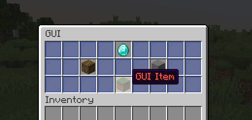

<center><h1>GUI</h1></center>
<center>
<p>This is how you create a basic GUI</p>
</center>

# GUI




# Creating a GUI

To create a GUI all you need to do is:

```java
Gui gui = Gui.gui()
        .title(Component.text("GUI Title!"))
        .rows(6)
        .create();
```

# Creating a Typed GUI

```java
Gui gui = Gui.gui()
        .title(Component.text("GUI Title!"))
        .type(GuiType.DISPENSER)
        .create();
```

If the type is not specified, it'll fall back to `GuiType.CHEST`.

**Current supported GUI types:**

* CHEST - Default - 0 to 53 slots
* WORKBENCH - 0 to 9 slots
* HOPPER - 0 to 4 slots
* DISPENSER - 0 to 8 slots
* BREWING - 0 to 4 slots

# Creating a GUI item

Each item added to the GUI need to be a `GuiItem`.

```java
// Alternatively you can use the ItemBuilder
GuiItem guiItem = ItemBuilder.from(Material.STONE).asGuiItem();
GuiItem guiItem = ItemBuilder.from(Material.STONE).asGuiItem(event -> {
    // Handle your click action here
});
```

Each GUI item needs an item stack, the click action is optional.  
The action for an item is simply the `InventoryClickEvent` so handle it like you would be doing in your own listener.

# Adding the item to the GUI

Now that we have our `GuiItem`, we can easily add it to the GUI.

```java
// Using a slot number from 0 to 53
gui.setItem(slot, guiItem);

// Using rows and columns
gui.setItem(row, col, guiItem);

// Using add item to add to next free slot
gui.addItem(guiItem);
```
As an example: slot `0` would be `row: 1, col: 1`.  
What option you choose is up to you.

**Attention:** if you specify a slot that exceeds the GUI limit it'll throw a `GuiException`.

# Opening the GUI

To open the GUI to the player you just need to call the method `open`.

```java
gui.open(player);
```
